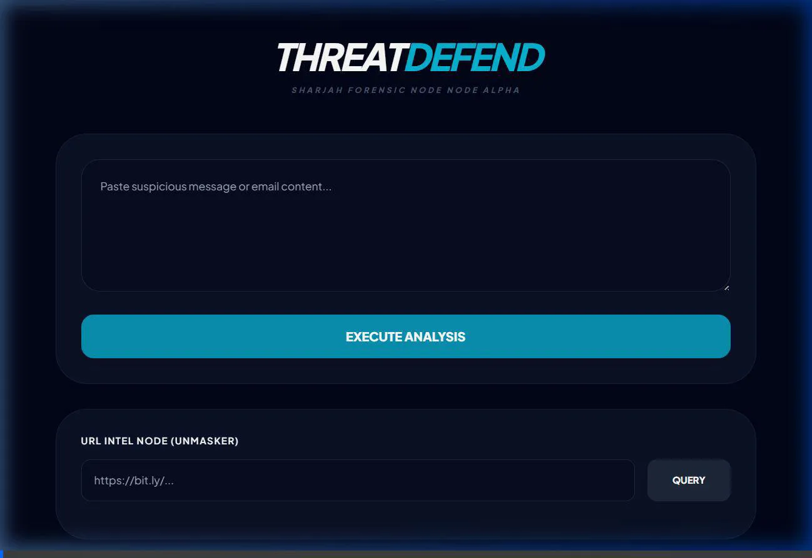
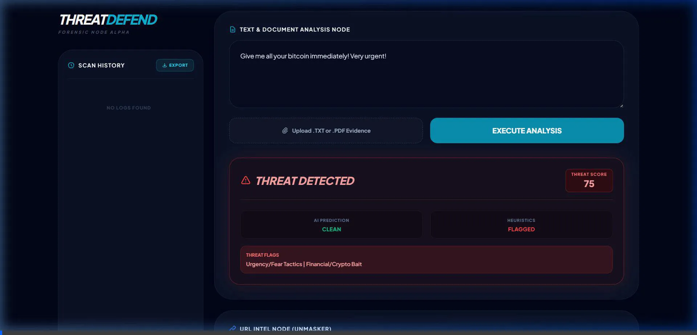
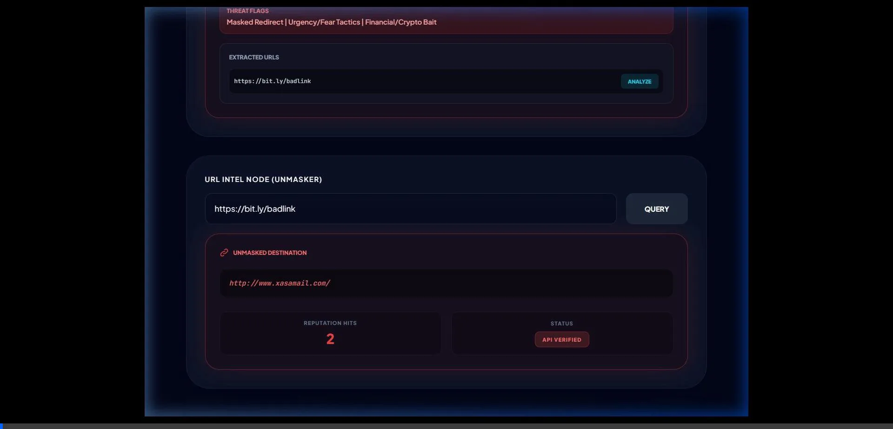
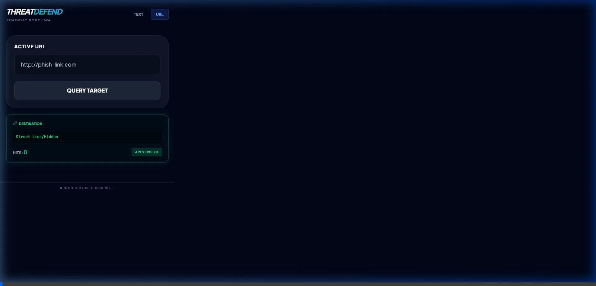
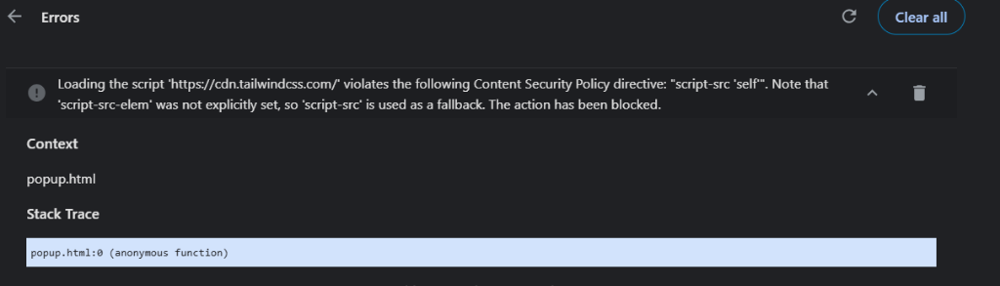

# ThreatDefend AI
**An intelligent, real-time phishing and spam detection Chrome Extension built with FastAPI and Transformers.**

[](https://www.python.org/downloads/)
[](https://fastapi.tiangolo.com/)
[](https://developer.chrome.com/docs/extensions/mv3/)
[](https://opensource.org/licenses/MIT)

</div>

---

## Overview

ThreatDefend AI is a lightweight, AI-driven forensic node designed to protect users from malicious content in real-time. Operating as a Chrome Extension backed by a local FastAPI server, it seamlessly scans web pages, highlights dangerous links, and analyzes text using local NLP models and heuristic rules.

<div align="center">
  
</div>

---

## Features

- **Local AI Analysis**: Uses lightweight sentence-transformers (all-MiniLM-L6-v2) to intelligently classify text as safe, spam, or phishing without sending your personal data to cloud APIs.
- **Full DOM Scanning**: Instantly scans all visible text, external links, and emails on the current page with a single click.
- **In-Page Threat Highlighting**: Malicious links are automatically highlighted in red with a pulsing "[MALICIOUS]" badge directly in your browser.
- **Shadow DOM Toast Notifications**: Real-time progress and detailed security reports are rendered cleanly on the page, bypassing strict Content Security Policies (CSPs) like those found on Gmail.
- **Link Defanging**: Extracted URLs are "defanged" (e.g., http[://]example[.]com) in the backend to prevent accidental clicks on dangerous links during analysis.
- **VirusTotal Integration**: Deeply scans suspicious domains and links against the VirusTotal API for known malware signatures.

<div align="center">
  
</div>

---

## Tech Stack

### Frontend (Chrome Extension)
*   Manifest V3 Architecture
*   Vanilla JavaScript (content.js, popup.js, background.js)
*   **Tailwind CSS**: Custom UI fully compiled offline to comply with strict Manifest V3 structural requirements.

### Backend (Python)
*   **FastAPI**: Blazing fast API server to handle extension requests.
*   **Transformers (Hugging Face)**: For on-device NLP processing.
*   **SQLite3**: Local tracking of verified threats.
*   **Uvicorn**: ASGI web server implementation.

---

## Installation and Setup

### 1. Start the Backend Server
You must run the local Python server for the extension to analyze data.

```bash
# Clone the repository
git clone https://github.com/yourusername/threatdefend-ai.git
cd threatdefend-ai

# Create a virtual environment (recommended)
python -m venv venv
source venv/bin/activate  # Or venv\Scripts\activate on Windows

# Install dependencies
pip install -r requirements.txt

# Create a .env file for your VirusTotal API key (Optional but recommended)
echo "VT_API_KEY=your_api_key_here" > .env

# Run the FastAPI server
uvicorn main:app --reload
```


<div align="center">
  
</div>

---

## Demo Gallery

### Video Walkthrough
Watch ThreatDefend AI in action identifying phishing text and analyzing suspicious URLs.

<div align="center">
  
</div>

### Page Analysis and Shadow DOM Toast Interface
The extension injects a secure, isolated UI directly into the webpage to provide real-time scanning progress and detailed structural breakdowns of found threats.


### Targeted Link Query
Manually input suspect text or URLs into the forensic node's popup interface to receive immediate, categorized threat intel.


---

*Built for a safer web.*

