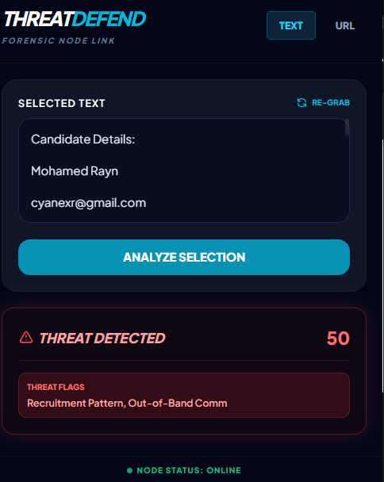

<div align="center">

# ThreatDefend AI
**An intelligent, real-time phishing and spam detection Chrome Extension built with FastAPI and Transformers.**

[](https://www.python.org/downloads/)
[](https://fastapi.tiangolo.com/)
[](https://developer.chrome.com/docs/extensions/mv3/)
[](https://opensource.org/licenses/MIT)

</div>

---

## 🛡️ Overview

**ThreatDefend AI** is a lightweight, purely local AI-driven forensic node designed to protect users from malicious content in real-time. Operating as a Chrome Extension backed by a local FastAPI server, it seamlessly scans web pages, highlights dangerous links, and analyzes text using local NLP models and heuristic rules—without sending your private data to cloud providers.

<div align="center">
  
</div>

---

## ✨ Features

- **Local AI Analysis**: Uses lightweight sentence-transformers (BERT-tiny) to classify text as safe, spam, or phishing entirely on your device.
- **Full DOM Scanning**: Scans all visible text, external links, and emails on the current page with a single click.
- **In-Page Threat Highlighting**: Malicious links are highlighted in red with a pulsing `[MALICIOUS]` badge directly in the browser's DOM.
- **Shadow DOM Toast Notifications**: Real-time scan progress and detailed reports rendered via an isolated Shadow DOM, bypassing strict CSP policies (e.g., Gmail).
- **Link Defanging & Unmasking**: URLs are "defanged" in analysis results to prevent accidental clicks, and short-links are automatically unmasked.
- **VirusTotal Integration**: Scans suspicious domains against the VirusTotal API for known malware signatures.
- **Dark/Light Dashboard Theme**: Web dashboard supports both themes with smooth glassmorphism CSS transitions and `localStorage` persistence.

<div align="center">
  
</div>

---

## 🏗️ Architecture

```text
┌─────────────────────────────────────────────────────────────────┐
│                     Chrome Extension (MV3)                      │
│  ┌──────────┐  ┌──────────┐  ┌────────────┐  ┌──────────────┐   │
│  │ popup.js │  │content.js│  │background.js│  │ popup.html   │   │
│  │(user UI) │  │(DOM scan)│  │(auto-scan)  │  │ (Tailwind)   │   │
│  └────┬─────┘  └────┬─────┘  └─────┬──────┘  └──────────────┘   │
│       │              │              │                           │
└───────┼──────────────┼──────────────┼───────────────────────────┘
        │ HTTP         │ HTTP         │ HTTP
        ▼              ▼              ▼
┌─────────────────────────────────────────────────────────────────┐
│                   FastAPI Backend (main.py)                     │
│                                                                 │
│  /api/analyze-text   ──▶  Heuristic Engine + AI Classifier      │
│  /api/analyze-url    ──▶  De-shortener + VirusTotal API         │
│  /api/analyze-file   ──▶  PDF/TXT Parser ──▶ Text Analysis      │
│  /api/history        ──▶  SQLite Scan Log                       │
│  /api/export         ──▶  Forensic Report Generator             │
│  /api/health         ──▶  Server Status & Readiness             │
│                                                                 │
│  ┌──────────────┐  ┌──────────────┐  ┌──────────────────────┐   │
│  │ BERT Tiny    │  │ VirusTotal   │  │ SQLite (threat_      │   │
│  │ (spam model) │  │ API Client   │  │  history.db)         │   │
│  └──────────────┘  └──────────────┘  └──────────────────────┘   │
└─────────────────────────────────────────────────────────────────┘
```

---

## 🚀 Getting Started

### 1. Start the Backend Server (Windows)

The backend must be running for the dashboard and extension to work. We've included a one-click startup script.

1. Clone the repository: `git clone https://github.com/yourusername/threatdefend-ai.git`
2. Open the folder and double-click `run_backend.bat`.
   - *This will automatically create a virtual environment, install requirements, and start the FastAPI server.*
3. (Optional) Create a `.env` file from `.env.example` and add your `VT_API_KEY` to enable VirusTotal integration.

**For Mac/Linux Users:**
```bash
python3 -m venv venv
source venv/bin/activate
pip install -r requirements.txt
python -m uvicorn main:app --reload
```

### 2. Open the Dashboard
Once the backend is running, simply double-click **`index.html`** to open the Forensic Dashboard in your browser.

### 3. Install the Chrome Extension
1. Open Google Chrome and navigate to `chrome://extensions/`.
2. Toggle **Developer mode** on in the top right corner.
3. Click **Load unpacked**.
4. Select the `chrome-extension` folder located inside the cloned repository.

<div align="center">
  
</div>

---

## 📸 Demo Gallery

### Page Analysis and Shadow DOM Toast Interface
The extension injects a secure, isolated UI directly into the webpage to provide real-time scanning progress and detailed structural breakdowns of found threats.


### Targeted Link Query
Manually input suspect text or URLs into the forensic node's popup interface to receive immediate, categorized threat intel.



---

## 📡 API Reference

The backend exposes a fully documented Swagger UI. Once running, visit `http://127.0.0.1:8000/docs`.

| Method | Endpoint | Description |
|--------|----------|-------------|
| `GET` | `/api/health` | Server status, model readiness, and version |
| `POST` | `/api/analyze-text` | Analyze text with local AI + heuristic scoring |
| `POST` | `/api/analyze-url` | De-shorten URL, check VirusTotal + pattern matching |
| `POST` | `/api/analyze-file` | Upload `.txt`/`.pdf`, extract text, and analyze |
| `GET` | `/api/history` | Retrieve the forensic SQLite scan log |
| `GET` | `/api/export` | Download full forensic report (`.txt`) format |

---

## 🤝 Contributing

We welcome contributions! Please follow these steps:
1. Fork the repository
2. Create your feature branch (`git checkout -b feature/amazing-feature`)
3. Commit your changes (`git commit -m 'Add amazing feature'`)
4. Push to the branch (`git push origin feature/amazing-feature`)
5. Open a Pull Request


---
<div align="center">
<i>Built for a safer web.</i>
</div>
